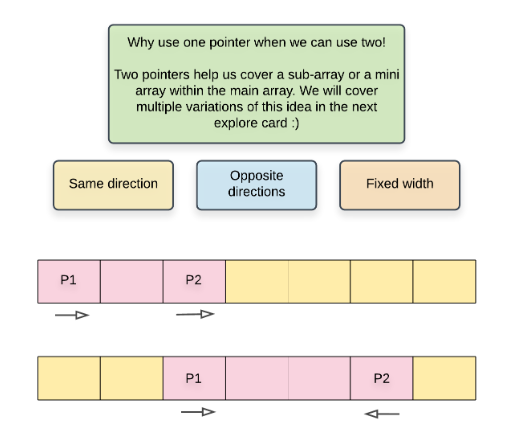

# Two pointer approach

When dealing with arrays that require us to find elements in sorted array for example, we can use a two pointer approach.

We use two pointers to point at different elements in the array, use a pointer to find the element we need, and move the same.
[Squares of sorted array](https://leetcode.com/explore/learn/card/fun-with-arrays/521/introduction/3240/)

In the below problem, we use three pointers- one to keep track of the position to insert and the other two to keep track of elements being parsed.
[Merge sorted array](https://leetcode.com/explore/learn/card/fun-with-arrays/525/inserting-items-into-an-array/3253/)

>[!tip]
>When comparing sorted arrays or sorting an array, it’s better to deal with the greatest element first, inserting it to the last index of the supposed sorted array.

In the below problem, not all elements are shifted. Instead, the elements pointed by the two pointers are swapped as necessary.
[Remove element from array](https://leetcode.com/explore/learn/card/fun-with-arrays/526/deleting-items-from-an-array/3247/)

When comparing two arrays (for sorting/merging etc), it is easier to place the largest element in the end instead on smallest element in the beginning.
[Merge sorted array alt](https://leetcode.com/explore/learn/card/fun-with-arrays/525/inserting-items-into-an-array/3253/)

The below problem is to remove all instances of an element from array. There can be two approaches to this. To have two pointers at the first and last element and to replace the first pointer value with the second pointer value. The second approach is to have two pointers pointing to the first element and the very next element. In the first approach, the two pointers grow closer together per iteration and in the second, the two pointers grow farther apart.
[Deleting items from array](https://leetcode.com/explore/learn/card/fun-with-arrays/526/deleting-items-from-an-array/3247/)

>[!tip] Better approach
Similar approach, but more concise- for removing duplicate elements in a sorted array. Note this one. Neat code and approach.
[Merge sorted arrays alt](https://leetcode.com/explore/learn/card/fun-with-arrays/526/deleting-items-from-an-array/3248/)

>[!todo]
#Redo You found alternate and simpler approach suggested in hint.
[Merge sorted arrays alt 2](https://leetcode.com/explore/learn/card/fun-with-arrays/511/in-place-operations/3259/)

In the below problem, an alternate approach would be to create a hashTable of all a\[i]\*2 values. So when iterating the elements, the hashTable can be checked to see if it's double value exists.
[Search for double value in array](https://leetcode.com/explore/learn/card/fun-with-arrays/527/searching-for-items-in-an-array/3250/)

# In place algorithms

Writing an algorithm in place means writing an algorithm that does not add any extra space to the program. If we write an algorithm to sort an array without modifying its size or creating a new temporary array to hold elements, then we add no new space. So space complexity remains the same. For example, a program to square every number in an array does not need any extra space. It can be done in place. Though, in place algorithms modifying the original elements in the data structure.

>[!todo]
#Redo You found alternate and simpler approach suggested in hint.
[Replace element with greater element](https://leetcode.com/explore/learn/card/fun-with-arrays/511/in-place-operations/3259/)

# Counters or Flagging approach

In the below problem, we are duplicating zeroes by continuously moving elements to the right whenever a zero is discovered
[Inserting elements into array](https://leetcode.com/explore/learn/card/fun-with-arrays/525/inserting-items-into-an-array/3245/)

An alternate approach would be to create a copy of the array and flag non zero numbers. Whenever a zero pops up up (in i) in the original array, we duplicate it to the next element (in i+1) and copy the original number from the copy array (from i+1) and insert it into position in the original array (i+2).

> [!note]
> Flagging can be done in the original array if the values don't matter or a copy can be made into another array and modified. Flagging is mainly done to mark the position of an element.

>[!note] Interesting problem 
[Find all numbers disappeared in an array](https://leetcode.com/explore/learn/card/fun-with-arrays/523/conclusion/3270/)
>
Here, we are marking all the positions of numbers that are available. To do so, we are multiplying the element in that position by -1. So if number 5 is available, we are marking the element in position 5 as -ve. So we know the number 5 is available in array. Whichever number is not available, that position will be left positive. So we know which position’s numbers are unavailable. We are following the flagging approach here.

In the below problem, there is a more simpler approach than the one you did. It involves reversing the array which is also the top solution. If k is the number by which the array needs to be rotated,
1. Reverse the entire array
2. Reverse again from 0 to k
3. Reverse the rest from k to n
So when k is 2, \[1,2,3,4,5] becomes \[5,4,3,2,1] and then \[4,5,3,2,1] and then \[4,5,1,2,3].
[Rotate array](https://leetcode.com/explore/learn/card/array-and-string/204/conclusion/1182/)