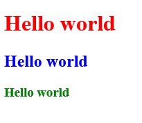

CSS is short for Cascading Stylesheets. It’s not a programming language but a styling language. It is used for website layout and design.

We can add css via three methods

1. Inline: Directly in the html tag. Not recommended.
2. Internal: Using `<style>` tags within the html file (in the header).
3. External: Linking an external CSS file.

It’s always recommended to keep the functionality, styling and presentation separate.

Inline:

`<h1 style="color:red">Hello world</h1>`

Internal:

```html
<head>
	<title>CSS Cheatsheet</title>
	<style type="text/css">
		h2{
		color:blue;
		}
	</style>
</head>
```

We are just grabbing on to the tag and changing its properties. We can use ‘id’ or ‘class’ attribute to grab on to specific portions.

External:

```html
<head>
		<title>CSS Cheatsheet</title>
		<style type="text/css">
			h2{
				color:blue;
			}
		</style>
		<link rel="stylesheet" type="text/css" href="css/style.css">
</head>
```

The href gives the location of the css file. Here, the folder name is css and the file name is style.css. In that file, we just have

```css
h3{
    color:green;
}
```
If the html body is

```html
<body>
	<h1 style="color:red">Hello world</h1>
	<h2>Hello world</h2>
	<h3>Hello world</h3>
</body>
```

Then we would have



CSS selectors


The ‘a’ is the link. It could be ‘h1’ the tag or ‘titleEle’ which could be a class or an id.

If the css is changed to

```css
body{
  background-color:#f4f4f4;
  color:#555555;
}
```

Then the page becomes


Here, the background is changed to light gray and any text not having their own style is now given the color specified in this file which is dark gray. The values are in hexadecimal.


`font-family: Arial, Helvetica, sans-serif;`
`font-size: 12px;`
`font-weight: bold;`

If arial is not able to load, it loads helvetica and sans-serif is the third option.

Web safe fonts are fonts that can be used directly. Other types of styled fonts need to be imported and linked similar to how a css file is linked.

font-weight can be bold, normal or a number like 400. The above code can be shortened.

`font: bold 12px Arial, Helvetica, sans-serif;`

```css
body{
	background-color:#f4f4f4;
	color:#555555;
	
	font-family: Arial, Helvetica, sans-serif;
	font-size: 12px;
	font-weight: bold;
	/* same as above
	font: bold 12px Arial, Helvetica, sans-serif;
	*/
	
	line-height: 1.6em;
}
```

line-height adds spacing between lines. em is a unit smilar to px.


Class vs Id:

There’s no real difference between the two but it’s advisable to use classes when the formatting needs to be reused i.e multiple sections can be given same class so that the styling for all those sections is same. Id should be used whenever a section is unique and it’s styling is not reused.

```html
<body>
		<div class="container">
			<div class="box1">
				<h1>Hello world</h1>
				<p>Lorem ipsum dolor sit amet, consectetur adipiscing elit. Quisque scelerisque augue tincidunt, laoreet lorem quis, ultrices mauris. Class aptent taciti sociosqu ad litora torquent per conubia nostra, per inceptos himenaeos. Nullam vulputate sem suscipit velit condimentum suscipit. Integer vitae magna a tortor varius lobortis non imperdiet tellus. Suspendisse quis lectus tristique, dapibus felis eu, tristique tortor. Praesent et pulvinar arcu. Cras eget enim nisi.</<p>
			</div>
		</div>
	</body>
```

```css
.container{
	width:80%;
	margin:auto;
}

.box1{
	background-color:#333333;
	color:#ffffff;
}
```


Setting the width to 80% makes the div cover 80% of the browser window. It can also be set to a set width like 500px but doing so would result in the div being non responsive i.e when the browser is shrunk, the text does not adapt to the new window size. It will remain at 500px and the text would overflow and would not be visible. Setting margin to auto will move the div to the middle. It can also be assigned a number like 30px or 50px but that would only assign the margin to the left.

The box margin:


Padding is the space between the content and its border or edge. Margin is the space between the border and the window edge.


Margin can the specified in any of the above three ways. The second one goes top-right-bottom-left. The third one goes topbottom-rightleft.

`border:5px red solid;`


`border-right:5px red solid;` would apply the border on one side.

The individual parameters can also be specified separately like `border-right-width:5px;` or `border-top-style:dotted;`

`padding-top:50px;` gives


`margin-left:50px;`


We can also grab on to one tag in the div like below.

```css
.box1 h1{
		font-family:Tahoma;
		font-weight:800;
		font-style:italic;
		text-decoration:underline;
		text-transform:uppercase;
		Letter-spscing:0.2em;
		word-spacing:1em;
}
```


```html
<div class="categories">
		<h2>Categories</h2>
		<ul>
			<li><a href="#">Category1</a></li>
			<li><a href="#">Category2</a></li>
			<li><a href="#">Category3</a></li>
			<li><a href="#">Category4</a></li>
		</ul>
</div>
```

```css

a{
	text-decoration:none;
	color:#000;
}

a:hover{
	color:red;
}

a:hover{
	color:red;
}

a:active{
	color:green;
}

a:visited{
	color:yellow;
}
.categories{
	border:1px green dotted;
	padding:10px;
	border-radius:15px;
	margin:20px 0;
}

.categories h2{
	text-align:center;
}

.categories ul{
	padding:0;
	list-style:square;
}
```


Anything after a: covers the action. a:hover changes the color when hovering over the link. a:active changes color when clicking on the link. a:visited changes to color for all previously visited links. It takes the href into consideration so even if two different hyperlinks point to the same location, all of their colors will change.