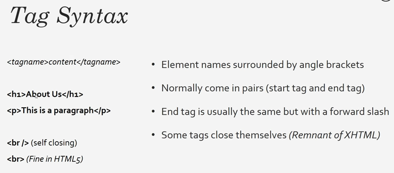

HTML stands for Hyper Text Markup Language.

It is not a programming language. It is used for building documents and webpages. Ex. Programming languages can execute logic while HTML can’t. It is the building blocks of the web.

Files must end with .html extension. It does not need a server and runs on a web browser.

index.html is the root or home of a website. It is the default behavior.

If just text like “Hello world” is saved in the file without any tag, loading the file will display the text.



HTML structure


The `<head>` content is not displayed in the browser. It has title, CSS links, Javascript links, metadata like description, keyword etc. The description and keyword are used by search engines like Google. The `<body>` contains the markup that is displayed in the browser.


Sample:

```html
<!DOCTYPE html>
<html>
	<head>
		<title>HTML Demo</title>
	</head>
	<body>
		<!--This is the comment section-->
		<h1>Heading one</h1>
		<h2>Heading two</h2>
		<p>Lorem ipsum dolor sit amet, consectetur adipiscing.</p>
		<p>Lorem ipsum dolor sit amet, consectetur adipiscing.</p>
	</body>
</html>
```


Hitting Ctrl+U will show the html source code on the page. F12 will display the browser’s developer tools.

Headings are h1 through h6 and their size will vary. h1 will be big and have some padding around the text.

Any CSS styling on the html can be displayed when hovering over the element. Below- Firefox and Chrome.


Inline elements do not take a new line and takes only necessary width. Block elements take a new line and use full width available. Block level - `<div>`,`<h1>`. Inline - `<span>`,``.

`<strong></strong>` tag by default will make the text within bold.

`<em>` will make it italic.

However, these tags can be grabbed using CSS and their styles can be changed.

`<a href=”about.html”>Lorem ipsum</a>` or `<a href=”http://google.com” target="_blank">Lorem ipsum</a>` will provide a hyperlink to the link within. target=”_blank” will cause the link to open in a new tab instead of the same tab. Usually used to link external sites.

href and target are called Tag attributes.


Lists can be defined using `<ul>` or `<ol>` which are unordered and ordered lists respectively. `<li>` is used to define the list elements.

```html
<!DOCTYPE html>
<html>
	<head>
		<title>HTML Demo</title>
	</head>
	<body>
		<!--This is the comment section-->
		<h3>Heading</h4>
		<p>Lorem ipsum <strong>dolor sit amet</strong>, consectetur <em>adipiscing</em> ipsum.</p>
		<p><a href=”about.html”>Lorem ipsum</a> dolor sit <a href=”http://google.com” target="_blank">amet, consectetur</a> adipiscing.</p>
		
		<!--Lists-->
		<ul>
			<li>List item 1</li>
			<li>List item 2</li>
			<li>List item 3</li>
		</ul>
		
		<ol>
			<li>List item 1</li>
			<li>List item 2</li>
			<li>List item 3</li>
		</ol>
		
	</body>
</html>
```


A table has many elements.

- `<table>` creates the table.
- `<thead>` is for the table headers.
- `<tbody>` is for the table body.
- `<tr>` creates a table row.
- `<th>` is for marking header elements.
- `<td>` is for marking actual table data elements.

```html
<body>
		<!--Table-->
		<table>
			<thead>
				<tr>
					<th>Name</th>
					<th>Email</th>
					<th>Age</th>
				</tr>
			</thead>
			<tbody>
				<tr>
					<td>John Doe</td>
					<td>john@gmail.com</td>
					<td>20</td>
				</tr>
				<tr>
					<td>Jane Kelly</td>
					<td>jane@gmail.com</td>
					<td>25</td>
				</tr>
			</tbody>
		</table>
	</body>
```


The table has default formatting so it may look unappealing. This can be changed using CSS.

`<hr>` tag puts a horizontal line.

Forms:

Usually, forms contain an attribute called action which is used to submit the form to a page. method attribute will specify whether it is a GET or POST.

```html
<br><br>
<hr>
<form action="process.php" method="POST">
	<label>First name</label>
	<input type="text" name="firstName">
	<label>Last name</label>
	<input type="text" name="lastName">
</form>
```

The name attribute is used to grab the value of the field in the form that is being submitted.


Labels and inputs are both inline so they show up on the same line. To modify, we can wrap then in the `<div>` tag which are block level elements.

```html
<div>
	<label>Last name</label>
	<input type="text" name="lastName">
</div>
<div>
	<label>Email</label>
	<input type="email" name="email" placeholder="example@gmail.com">
</div>
<div>
	<label>Message</label>
	<textarea name="message"></textarea>
</div>
<div>
	<label>Gender</label>
	<select name="gender">
		<option value="male">Male</option>
		<option value="female">Female</option>
		<option value="other">Other</option>
	</select>
</div>
<div>
	<label>Age</label>
	<input type="number" name="age" value="30">
</div>
<div>
	<label>Gender</label>
	<input type="date" name="Birthday">
</div>
<input type="submit" name="submitbutton" value="Click here">
```


email type will provide validation when we are submitting form. It will check form @gmail.com (example) domain. `<textarea>` will give us a resizable text box. `<select>` tag will give us a drop down list with `<option>` giving the selectable values. value attribute in `<input>` will populate a default value for us. placeholder attribute will give us a greyed out value (disappears upon entering actual text.).

The “submit” type will give us a clickable button and upon clicking, will take us to “process.php” as written in the `<form>` tag.


A button can also be placed using `<button>` tag but we can’t do anything with it without Javascript.

`<a href="images/bird.jpg">`

``

`</a>`


“alt” attribute will give us alternate text to be displayed when image is not available. The width and height attribute are available but is advised to use CSS. Images are also inline.

Wrapping the image in a `<a>` tag (link) will make the image clickable and open it in the browser in its original size.

```html
<blockquote cite="[http://quotes.com](http://quotes.com/)">
Lorem ipsum dolor sit amet, consectetur adipiscing ipsum.
</blockquote>
<p>Example for <abbr title="World Wide Web">WWW</abbr> expansion</p>
<p><cite>HTML course</cite> by Brad Traversy</p>
```

In `<blockquote>` tag, the cite attribute will show up when we look at the source code inside the browser. `<abbr>` will case the expanded text to show up when we hover. `<cite>` tag will cause the text to become stylized.


```html
<!DOCTYPE html>
<html>
	<head>
		<title>HTML5 Tags Demo 2</title>
	</head>
	<body>
		<header id="mainHeader">
			<h1>My Website</h1>
		</header>
	
		<section>
			<article class="post">
				<h3>First Blog Post</h3>
				<small>Posted by John Doe</small>
				<p>Lorem ipsum dolor sit amet, consectetur adipiscing elit. Quisque scelerisque augue tincidunt, laoreet lorem quis, ultrices mauris.
				Tempor semper justo odio ut metus. Aenean nisl augue, maximus vel condimentum fermentum, cursus id nibh. Quisque ut iaculis dolor.</p>
				<a href="post.html">Read more</a>
			</article>
			<article class="post">
				<h3>Second Blog Post</h3>
				<small>Posted by John Doe</small>
				<p>Lorem ipsum dolor sit amet, consectetur adipiscing elit. Quisque scelerisque augue tincidunt, laoreet lorem quis, ultrices mauris.
				Tempor semper justo odio ut metus. Aenean nisl augue, maximus vel condimentum fermentum, cursus id nibh. Quisque ut iaculis dolor.</p>
				<a href="post.html">Read more</a>
			</article>
			<article class="post">	
				<h3>Third Blog Post</h3>
				<small>Posted by John Doe</small>
				<p>Lorem ipsum dolor sit amet, consectetur adipiscing elit. Quisque scelerisque augue tincidunt, laoreet lorem quis, ultrices mauris.
				Tempor semper justo odio ut metus. Aenean nisl augue, maximus vel condimentum fermentum, cursus id nibh. Quisque ut iaculis dolor.</p>
				<a href="post.html">Read more</a>
			</article>	
		</section>
			
		<aside>
			<nav>
				<ul>
					<li><a href="#">Category 1</a></li>
					<li><a href="cat2.html">Category 2</a></li>
					<li><a href="cat3.html">Category 3</a></li>
				</ul>
			</nav>
		</aside>
			
		<footer id="mainFooter">
			<p>Copyright &copy; 2023, My Website</p>
		</footer>
	</body>
</html>
```

The above example showcases HTML5 symantic tags. These are basically divisions of various sections that can be used to split our page for ease of use. Without CSS, all of them will be displayed sequentially without any style but the divisions make it easier for us to grab using CSS.

HTML also has keywords like &copy; which gives the copyright symbol. Websites can have multiple headers and footers so it’s good to assign them an id to style them individually using CSS.


An example of CSS is given below.

```html
<title>HTML5 Tags Demo 2</title>
		<style type="text/css">
			#mainHeader{
				text-align:center;
				background-color:black;
				color:white;
				padding:10px;
			}
			#mainFooter{
				text-align:center;
				font-size:18px;
				padding:10px;
			}
		</style>
```

Metadata can be added to the html as below

`<meta name="description" content="My blog demo">`
`<meta name="keywords" content="HTML example, web dev, Traversy media">`

Metadata is used be search engines while indexing webpages so they are used to identify our page.

Continuation to CSS basics:
[[../CSS/CSS|CSS]]