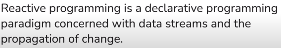

Meaning, it is used when we deal with a stream(continuous/ not fixed) of data.

Imperative- doing all the steps

Declarative- declaring the steps i.e not immediately carried out

Reactive does not imply async. Reactive can be synchronous and non-reactive can be asynchronous.

Button click- User clicks a button, execute a function

I/O response- user asks for something or if a file is finished being read, do something

Similar to event driven programs- a trigger happens and a method executes

While a request is sent, we have to wait for a response and only then send another request.

Modern applications require high data scale(large amount of data) and high usage scale(more users hence increased availability)

Vertical scaling- increase RAM, processor capacity etc

Horizontal scaling- adding more servers

The thread which executes the first DB call (`getUser`) waits till the request is complete and only then moves to the second DB call (`getPreferences`). This is called a **blocking** DB call. They are sequential which is unnecessary.

Performance takes a hit in this case.

In this case, the longer a thread waits to get a response from the server, the higher the number of threads active on the server. At one point, the thread capacity is reached. So any requests coming at this time has to wait for one of the threads to be freed. When the thread is waiting, it is called an **idling thread**. In this case, hardware is wasted. The scaling takes a hit.

With Spring MVC, the below happens

The below is not very important. `ConpletableFuture`.

This is from concurrency APIs where `userAync` and `userPreferencesAsyc` are executed in parallel ah when they are done, they are combined using `bothFutures`. join is still blocking as the return type is User.

Same code in reactive

Iterator vs Observer design pattern

In both cases, the purpose is the same. Difference is, data is obtained whenever consumer asks for it in iterator and data is obtained whenever source pushes it in observer.

In observer, the source has a bunch of observers and when an event happens, a method of the corresponding observer is triggered.

Streams

`intNumberStream` and `userStream` are “`Stream<>`” objects. Map replaces a given object with another object. `flatMap` flattens a stream into its corresponding objects. In streams, we chain operations.

Below is the concept and not actual code.

to

to

Example

`subscribe()` is like an observer to something that can emit an event.

The reason why we are waiting to kill the application using `.read()` is because we need the application to be running for a reactive stream to get data. In web applications, the application is always running. 

In the above case, the flux operations do not take place in sequence. Rather, both execute in async.

The flux (’stream’ variable) is the publisher and and we subscribe to it to get the data.

The nature of the above code is blocking. This is because the program has to wait for numbers to be filled before moving to the print statement. the `toStream()` blocks the process until all elements from the flux are collected.

Project Reactor uses two classes that deals with events- a Mono and a Flux.

A Flux is a sequence of events(0 or n) while a Mono is a single event(0 or 1).

In the below example, the block() functions blocks the thread until the Mono returns a value i.e until `intNumberMono` emits a value. Same is the case for `blockOptional()`. Optional is incase the Mono returns a null.

A Mono or a Flux can return one of three things

- An Item
- A complete event
- A failure event

A completion event is what is sent when there are no more elements left for the Mono or the Flux to send. A failure event is sent whenever an error occurs. A complete or failure event is known as terminal event.

subscribe also has various input parameters.

In the above example, the subscribe method defines the actions for when it gets an item, a failure event and a complete event.

In the above example, we are handing the implementation of the subscription, next, error etc. to a custom class. It does the same thing as the example above this one.

**Backpressure**

Sometimes, the flux may sent more events than the program is able to handle at a time. In such cases, the entire flow stops with an error. This is known as backpressure. To avoid doing so, we can use a few methods. One such is shown below.

In this case, we tell the publisher to wait to push events until the existing elements are done. We are defining the number of elements that can be dealt with at a time. The same can be achieved using `limitRate()` method. More on that below.

There can be unresponsive Mono or Flux. In such cases, we can set a timeout.

Problem is, this will throw an exception. #lookupmore 

Reactive is particularly useful in web apps when there is a ton on incoming requests or there are tons of database connections required to be made.

Netty is a web server for reactive. When a request comes in, unlike tomcat, it does not wait for the request. It hands off the request to the program to execute on a thread and foes on to get the next request. When the request is complete and a response is ready, Netty assigns a free thread to pick up the response and send it back.

Couple this with DB connections being performed reactively. A thread hands a query to the DB, doesn’t wait for it to finish and proceeds to the next request. When the response is ready in the DB, a free thread picks it up. So at any time, no thread in the webserver or the program is blocked. They keep functioning.

This is achieved using a ‘Event loop‘. All threads in the program are never blocked- or more accurately, the threshold for blocking increases significantly. All threads are cycling between operations. A free thread picks up an operations, hands it off, and picks up a operation that has been completed and so on. 

In web applications, spring handles the allocation of threads so that the calls are non blocking.

It’s not usually that straightforward. Usually, we will do something like below.

In this, if we subscribe on `fetchUserMono`, a thread would execute that method but the current thread would move to the next line of code in `getUserDetails` which is not what we want.

To achieve our requirement, we need to use operators. Operators are similar to stream operators.

filter will give a filtered flux to which the final subscribe operation happens.

`.log()` logs every element obtained in the flux.

`.take()` gives the first n elements in the flux.

`.defaultIfEmpty()` gives a default value if the flux is empty.

Marble diagram

In the above example, there filter returns a Flux for each match. So if there are 10 matches, we get 10 separate fluxes. What `flatMap()` does is, it takes those 10 fluxes and flattens them into one single flux.

### Error handling

In the first example, the error is consumed and it is handled.

In the second example, the error is not handled. Rather, `doOnError()` does something when the error happens but the error is still thrown.

In the third example, the errored out element is given to us and we decide what to do with it. The flux does not stop and proceeds with the next element.

In the fourth example, the incoming flux is replaced with another flux when an error happens.

`doFinally()` is triggered when the operations are done successfully or if an error happens (i.e) on terminal events.

Flux to Mono

`.count()` returns a `Mono<long>`

`.collecList()` returns a `Mono<List<Integer>>`

`.buffer()` gives us a list of n elements of the flux combined line \[1,2], \[3,4], \[5,6].etc

### WebFlux

When we write a regular rest controller,

The webserver makes 10 calls, and all 10 webserver threads wait for the response. So all 10 are blocking.

Project Reactor makes use of the Netty webserver.

Netty does not wait for the response. Since we are returning a Mono, it hands the request to the framework to handle, takes another request and when the response is ready, a free thread is assigned to return the response. So no threads in the thread pool of 10 (example) are blocked at a time. The threads are cycled to perform a free operation.

For example, if the return was `Mono.just(”Hello world”).delayElement(Duration.ofSeconds(5));` then each thread would not wait 5 seconds.

`greet()` would simply end and no thread would wait there. When the response is ready, Spring figures out which response to return to which request and return the value accordingly.

`greet()` would have held a thread thread while waiting for `getMessage()` to finish. Here, `greet()` just return a Mono. Spring figures out which result is for which Mono and assigns the value to the HTTP request that is still waiting. In this approach, no thread is held up.

The only person waiting in this case is the end user but the processing time is faster in case of multiple incoming request because the threads are being cycled instead of blocking.

Zipping combines the values of different Monos of Fluxes and performs any subsequent operation. Here, both `computeMessage()` and `getNameFromDB()` return `Mono<String>`.

Assuming both methods take 5 seconds to respond separately, with Reactive, threads operate in parallel and gives us the response in 5 seconds in total instead of the 10 if it was done with a blocking approach. Added advantage is that no thread is waiting for the response. The thread is assigned to return when the result is ready. 

### Miscellaneous

`produces = “text/event-stream”` keeps the connection between client and webserver open so that whenever there is an addition/change in the database is emitted and sent back at at any point in time. So data is streamed in real time. Same functionality with `consumes`.

Read the Java docs for more questions/clarity.

#reference  [Project reactor introduction](https://www.linkedin.com/pulse/project-reactor-core-introduction-anmol-bhatia/?trackingId=lOIhEUptRJioOYJpZoCx6w%3D%3D), [Javabrains Reactive playlist](https://www.youtube.com/playlist?list=PLqq-6Pq4lTTYPR2oH7kgElMYZhJd4vOGI)